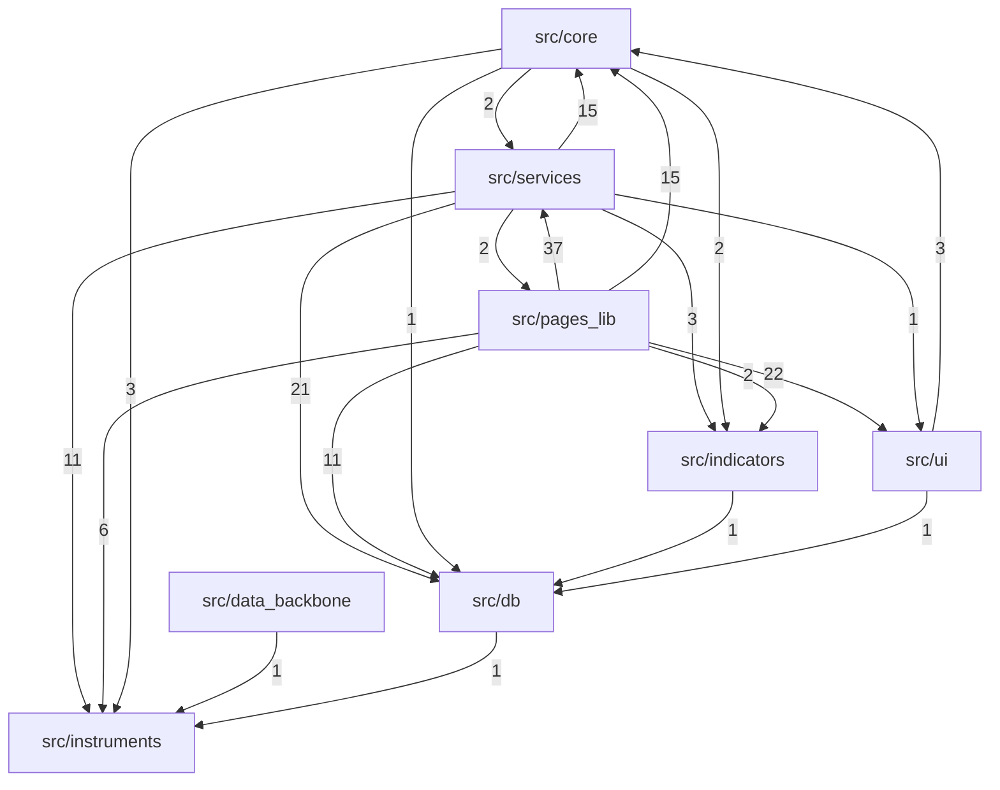

# Architecture — how the code connects

> Generated by `python docs/generate_architecture.py`. Do not edit by hand: every fact below is read out of the source with `ast`, so it is correct on the day it is run and wrong the moment someone edits it instead of regenerating.

_Last generated 2026-08-15 — 107 modules, 237 internal import edges._

`.foglamp/scan.html` maps the **deployment** graph — which container runs what. This maps the **code** — which module calls which.

Every module below has its own note listing what it imports and what imports it, so the Obsidian graph is the real dependency graph rather than a scatter of unlinked dots. Start anywhere and follow the edges.

**The rest of the documentation:** [[README]] · [[System_Guide]] · [[Live_Session_Runbook]] · [[MT5_MCP]]

## Layers

Dependencies point down this list. A module importing from a layer above it is the signal that something is in the wrong place.

| Layer | Modules | Role |
|---|---:|---|
| `src/instruments/` | 1 | The registry — the one list of tradeable symbols. Imports nothing. |
| `src/core/` | 19 | Pure logic: signals, maths, indicators. No database, no network, no Streamlit. |
| `src/indicators/` | 3 | Technical-indicator maths, used by core and by pages. |
| `src/db/` | 5 | Postgres access and the OHLC read-through cache. Knows nothing about pages. |
| `src/services/` | 45 | Orchestration: fetches, sweeps, scoring, broker sync. Where I/O lives. |
| `src/data_backbone/` | 6 | The background store refresher (its own container). |
| `src/pages_lib/` | 21 | Streamlit page bodies. The only place `st.*` is normal. |
| `src/ui/` | 4 | Theme and shared widgets. Owns every colour and font in the app. |

## Layer dependency graph

Edge labels are the number of import statements, so a thick edge is a real coupling and a thin one is often a single helper.

## The most-depended-on modules

If you are changing one of these, the blast radius is the second column. These are the load-bearing walls.

| Module | Imported by | Purpose |
|---|---:|---|
| [[src.db.market_cache\|market_cache.py]] | 23 | Streamlit read-through cache for market data, backed by Postgres |
| [[src.instruments.registry\|registry.py]] | 23 | Instrument registry — single source of truth |
| [[src.ui.theme\|theme.py]] | 14 | Bloomberg-terminal palette + global CSS injection |
| [[src.pages_lib.base\|base.py]] | 12 | Base class for every Bloomberg-styled Streamlit page |
| [[src.db.cache\|cache.py]] | 11 | Connection pooling for the Postgres trade repository |
| [[src.ui.components\|components.py]] | 10 | Object-oriented Bloomberg-terminal UI primitives |
| [[src.services.signal_store\|signal_store.py]] | 9 | Shared trade-signal persistence — save any page's signals to ``trade_setups`` |
| [[src.core.bias\|bias.py]] | 8 | Canonical directional bias — the single definition of BULLISH / BEARISH / |
| [[src.core.config\|config.py]] | 8 | — |
| [[src.services.market_data\|market_data.py]] | 8 | Canonical market-data spine — the one OHLC feed every page reads from |
| [[src.indicators.technical\|technical.py]] | 7 | Static technical-indicator helpers |
| [[src.services.tool_log\|tool_log.py]] | 7 | Shared usage logging for the interactive tool pages (R:R Calculator, |
| [[src.services.bias_service\|bias_service.py]] | 6 | Streamlit-facing wrapper over the canonical bias engine |
| [[src.db.trade_repository\|trade_repository.py]] | 5 | Trade persistence via PostgreSQL |
| [[src.services.alert_service\|alert_service.py]] | 5 | Shared email-alert plumbing for the scanner pages |

## `src/instruments/`

_The registry — the one list of tradeable symbols. Imports nothing._

| Module | Lines | Imported by | Purpose |
|---|---:|---:|---|
| [[src.instruments.registry\|registry.py]] | 210 | 23 | Instrument registry — single source of truth |

## `src/core/`

_Pure logic: signals, maths, indicators. No database, no network, no Streamlit._

| Module | Lines | Imported by | Purpose |
|---|---:|---:|---|
| [[src.core.ai_reports\|ai_reports.py]] | 94 | 0 | Optional Claude-powered narrative summaries for the Reports page |
| [[src.core.analyzer\|analyzer.py]] | 491 | 2 | — |
| [[src.core.bias\|bias.py]] | 210 | 8 | Canonical directional bias — the single definition of BULLISH / BEARISH / |
| [[src.core.biased_pivots\|biased_pivots.py]] | 163 | 1 | FX Bootcamp "Biased Pivots" — the pivot levels from the desk's own charts |
| [[src.core.concentration\|concentration.py]] | 526 | 0 | Martingale & concentration diagnostics for trading P&L sequences |
| [[src.core.config\|config.py]] | 158 | 8 | — |
| [[src.core.data_provider\|data_provider.py]] | 272 | 2 | — |
| [[src.core.fibo_ribbon\|fibo_ribbon.py]] | 148 | 1 | The desk's chart MA stack as a directional read — pure, no I/O |
| [[src.core.jump_model\|jump_model.py]] | 576 | 1 | jump_model.py |
| [[src.core.observability\|observability.py]] | 469 | 2 | Central observability: structured logging + event recording |
| [[src.core.quant_models\|quant_models.py]] | 475 | 3 | quant_models.py |
| [[src.core.reporting\|reporting.py]] | 306 | 0 | Report builders + rule-based intelligence for the Reports page |
| [[src.core.secrets\|secrets.py]] | 264 | 2 | Single source of truth for all sensitive configuration |
| [[src.core.signals\|signals.py]] | 1152 | 4 | — |
| [[src.core.stochastic\|stochastic.py]] | 653 | 1 | Stochastic calculus toolkit for price series |
| [[src.core.threat_core\|threat_core.py]] | 369 | 0 | threat_core.py — pure logic for the Threat Board |
| [[src.core.threat_sentry_hook\|threat_sentry_hook.py]] | 91 | 0 | threat_sentry_hook.py — evening_sentry v2 integration |
| [[src.core.todays_trades\|todays_trades.py]] | 483 | 3 | Today's tradeable ideas — consensus across every signal source, sized |
| [[src.core.volume_profile\|volume_profile.py]] | 467 | 1 | Fixed-range volume profile — TradingView's FRVP, anchored to session breaks |

## `src/indicators/`

_Technical-indicator maths, used by core and by pages._

| Module | Lines | Imported by | Purpose |
|---|---:|---:|---|
| [[src.indicators.leading\|leading.py]] | 234 | 0 | Leading indicators — oscillators and flow proxies that turn before price |
| [[src.indicators.technical\|technical.py]] | 92 | 7 | Static technical-indicator helpers |
| [[src.indicators.trend_signal\|trend_signal.py]] | 117 | 2 | Trend-following signal evaluator — preserves logic from daily-trading-checklist |

## `src/db/`

_Postgres access and the OHLC read-through cache. Knows nothing about pages._

| Module | Lines | Imported by | Purpose |
|---|---:|---:|---|
| [[src.db.cache\|cache.py]] | 168 | 11 | Connection pooling for the Postgres trade repository |
| [[src.db.connection\|connection.py]] | 89 | 3 | App-level database auto-connection |
| [[src.db.market_cache\|market_cache.py]] | 519 | 23 | Streamlit read-through cache for market data, backed by Postgres |
| [[src.db.market_data_repository\|market_data_repository.py]] | 312 | 3 | Market-data persistence via PostgreSQL |
| [[src.db.trade_repository\|trade_repository.py]] | 709 | 5 | Trade persistence via PostgreSQL |

## `src/services/`

_Orchestration: fetches, sweeps, scoring, broker sync. Where I/O lives._

| Module | Lines | Imported by | Purpose |
|---|---:|---:|---|
| [[src.services.account_state\|account_state.py]] | 115 | 1 | Persistent store for the live account balance |
| [[src.services.alert_service\|alert_service.py]] | 301 | 5 | Shared email-alert plumbing for the scanner pages |
| [[src.services.atr_service\|atr_service.py]] | 77 | 0 | ATR fetcher + derived SL/TP calculation |
| [[src.services.background_scanner\|background_scanner.py]] | 310 | 1 | Unattended ingest + score daemon — the app's data streams in day & night |
| [[src.services.backtest_service\|backtest_service.py]] | 699 | 0 | Production backtest engine — single source of truth for the 18-point |
| [[src.services.bias_service\|bias_service.py]] | 98 | 6 | Streamlit-facing wrapper over the canonical bias engine |
| [[src.services.broker_symbols\|broker_symbols.py]] | 50 | 5 | Broker symbol → registry instrument mapping |
| [[src.services.confluence_alert\|confluence_alert.py]] | 232 | 0 | Triple-confluence alert — the only thing that earns an email |
| [[src.services.correlation_service\|correlation_service.py]] | 47 | 0 | Correlation-exposure guard — flag stacked directional risk |
| [[src.services.cot_disaggregated\|cot_disaggregated.py]] | 142 | 1 | cot_disaggregated.py |
| [[src.services.cot_fetcher\|cot_fetcher.py]] | 240 | 2 | cot_fetcher.py |
| [[src.services.disconnect_drivers\|disconnect_drivers.py]] | 143 | 0 | Macro-driver map for the Disconnect Monitor — which economic driver moves |
| [[src.services.econ_calendar\|econ_calendar.py]] | 118 | 0 | Economic calendar — the week's scheduled events, as a reusable service |
| [[src.services.evening_sentry\|evening_sentry.py]] | 422 | 2 | evening_sentry.py  (v2) |
| [[src.services.exposure\|exposure.py]] | 230 | 1 | Currency-leg exposure guard — catch the stack `CORR_GROUPS` can't see |
| [[src.services.forecast_service\|forecast_service.py]] | 344 | 0 | Probability forecasting engine — Monte Carlo on daily closes |
| [[src.services.fred_data\|fred_data.py]] | 96 | 1 | Canonical macro spine — one definition of a FRED series, for every page |
| [[src.services.house_view_backtest\|house_view_backtest.py]] | 219 | 0 | Walk-forward validation of the canonical house view (src/core/bias.py) |
| [[src.services.index_analysis\|index_analysis.py]] | 63 | 0 | Correlation / relative-strength math for two price series (e.g. S&P 500 vs |
| [[src.services.market_data\|market_data.py]] | 124 | 8 | Canonical market-data spine — the one OHLC feed every page reads from |
| [[src.services.mt4_import\|mt4_import.py]] | 330 | 1 | Parse an MT4 'Save as Report' / 'Detailed Report' HTML statement into rows |
| [[src.services.mt4_watch\|mt4_watch.py]] | 94 | 0 | Durable config for the MT4 statement auto-importer |
| [[src.services.mt5_link\|mt5_link.py]] | 431 | 2 | Live MetaTrader 5 terminal link — read the real book, not a saved file |
| [[src.services.mt5_mcp\|mt5_mcp.py]] | 722 | 0 | MCP server exposing the live MetaTrader 5 terminal to an AI client |
| [[src.services.mt5_trade\|mt5_trade.py]] | 456 | 0 | Live MetaTrader 5 order execution for the Trading Journal's UI — the |
| [[src.services.mt5_trade_import\|mt5_trade_import.py]] | 341 | 0 | Import closed MT5 deals into ``trade_setups`` as graded, closed rows |
| [[src.services.mtf_service\|mtf_service.py]] | 71 | 0 | Multi-Timeframe alignment helper — Weekly / Daily / 4H EMA stance |
| [[src.services.news_fetcher\|news_fetcher.py]] | 246 | 0 | news_fetcher.py |
| [[src.services.open_positions\|open_positions.py]] | 191 | 5 | Durable store for the positions you are actually holding |
| [[src.services.parallel_fetch\|parallel_fetch.py]] | 80 | 2 | Thread-pool fan-out for I/O-bound per-item fetches (yfinance/Postgres) |
| [[src.services.position_risk\|position_risk.py]] | 488 | 1 | What the open book is actually risking, priced by the stochastic engine |
| [[src.services.precomputed\|precomputed.py]] | 223 | 3 | Precomputed score board — the worker's output the UI reads instead of |
| [[src.services.prediction_service\|prediction_service.py]] | 94 | 1 | Instrument Predictor's composite-signal aggregator — pure logic, no I/O |
| [[src.services.regime_service\|regime_service.py]] | 429 | 0 | Streamlit-facing wrapper over the statistical jump model |
| [[src.services.risk_service\|risk_service.py]] | 42 | 0 | Position sizing and R:R computation — pure functions wrapped in a class |
| [[src.services.score_history\|score_history.py]] | 96 | 0 | Persistent store for Setup Ranker's per-pair/direction score history |
| [[src.services.session_service\|session_service.py]] | 73 | 2 | Trading-session detection — Kill Zone classifier |
| [[src.services.signal_expiry\|signal_expiry.py]] | 134 | 1 | Price-based signal invalidation — is a saved ``trade_setups`` row still live? |
| [[src.services.signal_store\|signal_store.py]] | 160 | 9 | Shared trade-signal persistence — save any page's signals to ``trade_setups`` |
| [[src.services.signal_sweep\|signal_sweep.py]] | 348 | 0 | Run every signal page headlessly so its own code persists its signals |
| [[src.services.source_scorecard\|source_scorecard.py]] | 276 | 0 | Source scorecard — which signal sources actually predict winners? |
| [[src.services.surprise_service\|surprise_service.py]] | 66 | 0 | src/services/surprise_service.py |
| [[src.services.swing_playbook_service\|swing_playbook_service.py]] | 328 | 0 | src/services/swing_playbook_service.py |
| [[src.services.tool_log\|tool_log.py]] | 44 | 7 | Shared usage logging for the interactive tool pages (R:R Calculator, |
| [[src.services.week_ahead\|week_ahead.py]] | 189 | 0 | Week Ahead — the probabilistic range for the coming week |

## `src/data_backbone/`

_The background store refresher (its own container)._

| Module | Lines | Imported by | Purpose |
|---|---:|---:|---|
| [[src.data_backbone.app_demo\|app_demo.py]] | 49 | 0 | app_demo.py — minimal Streamlit demo of the data_backbone pipeline |
| [[src.data_backbone.config\|config.py]] | 63 | 0 | config.py — configuration for the data_backbone pipeline |
| [[src.data_backbone.data_access\|data_access.py]] | 100 | 0 | data_access.py — the read path your tabs call |
| [[src.data_backbone.db\|db.py]] | 174 | 0 | db.py — Postgres persistence (SQLAlchemy 2.0 Core) |
| [[src.data_backbone.seed_history\|seed_history.py]] | 144 | 0 | seed_history.py — one-shot historical backfill + coverage report |
| [[src.data_backbone.worker\|worker.py]] | 73 | 0 | worker.py — background service |

## `src/pages_lib/`

_Streamlit page bodies. The only place `st.*` is normal._

| Module | Lines | Imported by | Purpose |
|---|---:|---:|---|
| [[src.pages_lib.base\|base.py]] | 112 | 12 | Base class for every Bloomberg-styled Streamlit page |
| [[src.pages_lib.biased_pivots_page\|biased_pivots_page.py]] | 121 | 0 | Biased Pivots — the FX Bootcamp pivot zones, scanned across the universe |
| [[src.pages_lib.commodity_cot_lib\|commodity_cot_lib.py]] | 153 | 0 | commodity_cot_lib.py |
| [[src.pages_lib.correlations\|correlations.py]] | 378 | 0 | Correlations page — Bloomberg-terminal version |
| [[src.pages_lib.currency_strength\|currency_strength.py]] | 270 | 2 | Currency Strength Meter — rank the 9 base/quote currencies strong to weak |
| [[src.pages_lib.daily_trading.checklist\|checklist.py]] | 707 | 1 | Checklist mode — 18-point pre-trade confluence flow |
| [[src.pages_lib.daily_trading.page\|page.py]] | 33 | 0 | Daily Trading page composition — wires the checklist sidebar and controller |
| [[src.pages_lib.daily_trading.sentry_patch\|sentry_patch.py]] | 50 | 0 | sentry_patch.py — wiring for evening_sentry.py (v2) |
| [[src.pages_lib.daily_trading.sidebar\|sidebar.py]] | 270 | 2 | Sidebar controllers for the Daily Trading page |
| [[src.pages_lib.daily_trading.state\|state.py]] | 71 | 4 | Session-state initialisation and accessors for the Daily Trading page |
| [[src.pages_lib.daily_trading.trend\|trend.py]] | 346 | 1 | Trend-Following Signals mode — Bloomberg-styled signal scanner |
| [[src.pages_lib.dxy_gold\|dxy_gold.py]] | 316 | 0 | DXY vs Gold — the single most important macro correlation for gold traders |
| [[src.pages_lib.fib_entry\|fib_entry.py]] | 822 | 1 | 15M Fibonacci Entry — Bloomberg-terminal version |
| [[src.pages_lib.fibo_ribbon_page\|fibo_ribbon_page.py]] | 147 | 0 | Fibo Ribbon — the desk's own chart stack, scanned across the universe |
| [[src.pages_lib.instrument_predictor\|instrument_predictor.py]] | 309 | 0 | Instrument Predictor — one composite directional read per instrument |
| [[src.pages_lib.market_overview_lib\|market_overview_lib.py]] | 1055 | 0 | Shared logic for the Market Overview workbench and its broken-out pages |
| [[src.pages_lib.navigation\|navigation.py]] | 182 | 2 | Single source of truth for the page navigation |
| [[src.pages_lib.setup_ranker\|setup_ranker.py]] | 1599 | 2 | Setup Ranker page — Bloomberg-terminal version |
| [[src.pages_lib.system_guide\|system_guide.py]] | 56 | 0 | System Guide & Playbook — in-app view of docs/System_Guide.md, plus a PDF |
| [[src.pages_lib.todays_trades_page\|todays_trades_page.py]] | 362 | 0 | Today's Trades — the morning answer, on one screen |
| [[src.pages_lib.trend_signals\|trend_signals.py]] | 33 | 0 | Trend Signals — standalone Bloomberg-terminal page |

## `src/ui/`

_Theme and shared widgets. Owns every colour and font in the app._

| Module | Lines | Imported by | Purpose |
|---|---:|---:|---|
| [[src.ui.charts\|charts.py]] | 240 | 2 | Plotly chart factories — Bloomberg-tinted defaults |
| [[src.ui.components\|components.py]] | 351 | 10 | Object-oriented Bloomberg-terminal UI primitives |
| [[src.ui.theme\|theme.py]] | 723 | 14 | Bloomberg-terminal palette + global CSS injection |
| [[src.ui.tv_charts\|tv_charts.py]] | 277 | 0 | TradingView-style charts (pilot) via TradingView's open-source |

## Orphans

Modules nothing else imports. Some are entry points (a page body, a CLI); the rest are candidates for deletion.

- [[src.core.ai_reports]] — Optional Claude-powered narrative summaries for the Reports page
- [[src.core.concentration]] — Martingale & concentration diagnostics for trading P&L sequences
- [[src.core.reporting]] — Report builders + rule-based intelligence for the Reports page
- [[src.core.threat_core]] — threat_core.py — pure logic for the Threat Board
- [[src.core.threat_sentry_hook]] — threat_sentry_hook.py — evening_sentry v2 integration
- [[src.data.dukascopy_backfill]] — Dukascopy historical archive backfill — feeds the local debug mode's
- [[src.data_backbone.app_demo]] — app_demo.py — minimal Streamlit demo of the data_backbone pipeline
- [[src.data_backbone.config]] — config.py — configuration for the data_backbone pipeline
- [[src.data_backbone.data_access]] — data_access.py — the read path your tabs call
- [[src.data_backbone.db]] — db.py — Postgres persistence (SQLAlchemy 2.0 Core)
- [[src.data_backbone.seed_history]] — seed_history.py — one-shot historical backfill + coverage report
- [[src.data_backbone.worker]] — worker.py — background service
- [[src.debug.panel]] — Shared debug panel — data-source switching + the historical time machine
- [[src.indicators.leading]] — Leading indicators — oscillators and flow proxies that turn before price
- [[src.pages_lib.biased_pivots_page]] — Biased Pivots — the FX Bootcamp pivot zones, scanned across the universe
- [[src.pages_lib.commodity_cot_lib]] — commodity_cot_lib.py
- [[src.pages_lib.correlations]] — Correlations page — Bloomberg-terminal version
- [[src.pages_lib.daily_trading.page]] — Daily Trading page composition — wires the checklist sidebar and controller
- [[src.pages_lib.daily_trading.sentry_patch]] — sentry_patch.py — wiring for evening_sentry.py (v2)
- [[src.pages_lib.dxy_gold]] — DXY vs Gold — the single most important macro correlation for gold traders
- [[src.pages_lib.fibo_ribbon_page]] — Fibo Ribbon — the desk's own chart stack, scanned across the universe
- [[src.pages_lib.instrument_predictor]] — Instrument Predictor — one composite directional read per instrument
- [[src.pages_lib.market_overview_lib]] — Shared logic for the Market Overview workbench and its broken-out pages
- [[src.pages_lib.system_guide]] — System Guide & Playbook — in-app view of docs/System_Guide.md, plus a PDF
- [[src.pages_lib.todays_trades_page]] — Today's Trades — the morning answer, on one screen
- [[src.pages_lib.trend_signals]] — Trend Signals — standalone Bloomberg-terminal page
- [[src.services.atr_service]] — ATR fetcher + derived SL/TP calculation
- [[src.services.backtest_service]] — Production backtest engine — single source of truth for the 18-point
- [[src.services.confluence_alert]] — Triple-confluence alert — the only thing that earns an email
- [[src.services.correlation_service]] — Correlation-exposure guard — flag stacked directional risk
- [[src.services.disconnect_drivers]] — Macro-driver map for the Disconnect Monitor — which economic driver moves
- [[src.services.econ_calendar]] — Economic calendar — the week's scheduled events, as a reusable service
- [[src.services.forecast_service]] — Probability forecasting engine — Monte Carlo on daily closes
- [[src.services.house_view_backtest]] — Walk-forward validation of the canonical house view (src/core/bias.py)
- [[src.services.index_analysis]] — Correlation / relative-strength math for two price series (e.g. S&P 500 vs
- [[src.services.mt4_watch]] — Durable config for the MT4 statement auto-importer
- [[src.services.mt5_mcp]] — MCP server exposing the live MetaTrader 5 terminal to an AI client
- [[src.services.mt5_trade]] — Live MetaTrader 5 order execution for the Trading Journal's UI — the
- [[src.services.mt5_trade_import]] — Import closed MT5 deals into ``trade_setups`` as graded, closed rows
- [[src.services.mtf_service]] — Multi-Timeframe alignment helper — Weekly / Daily / 4H EMA stance
- [[src.services.news_fetcher]] — news_fetcher.py
- [[src.services.regime_service]] — Streamlit-facing wrapper over the statistical jump model
- [[src.services.risk_service]] — Position sizing and R:R computation — pure functions wrapped in a class
- [[src.services.score_history]] — Persistent store for Setup Ranker's per-pair/direction score history
- [[src.services.signal_sweep]] — Run every signal page headlessly so its own code persists its signals
- [[src.services.source_scorecard]] — Source scorecard — which signal sources actually predict winners?
- [[src.services.surprise_service]] — src/services/surprise_service.py
- [[src.services.swing_playbook_service]] — src/services/swing_playbook_service.py
- [[src.services.week_ahead]] — Week Ahead — the probabilistic range for the coming week
- [[src.ui.tv_charts]] — TradingView-style charts (pilot) via TradingView's open-source
